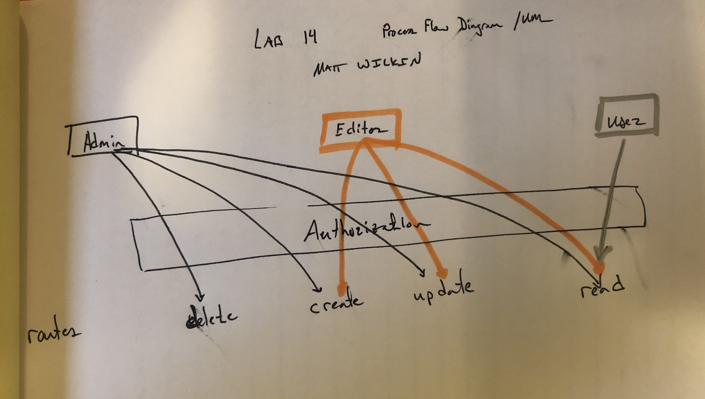

# lab-14 Access Control

### Author: Matt Wilkin

### Links and Resources

* [Submission PR](https://github.com/mwilkin-401-advanced-javascript/lab-14/pull/1)

* [Travis](https://www.travis-ci.com/mwilkin-401-advanced-javascript/lab-14)

* [Heroku](https://limitless-springs-36813.herokuapp.com/)

* [UML] 

### Documentation

#### Dependencies

  bcrypt

  cors 

  debug 

  dotenv

  eslint

  express

  jest

  jsonwebtoken

  mongodb-memory-server

  mongoose

  mongoose-schema-jsonschema

  morgan

  require-directory

  supertest
  
  swagger-ui-express

Modules

Exported Values and Methods

Routes

* Endpoint: `/signup`
  * not used in this project.
* Endpoint: `/signin`
  * not used in this project.
* Endpoint: `/oauth`
  * authorization route
* Endpoint: `/roles`
  * initialize roles
* Endpoint `/public-stuff`
  * auth route
* Endpoint `/hidden-stuff`
  * hidden stuff
* Endpoint `/something-to-read`
  * read
* Endpoint `/create-a-thing`
  * create
* Endpoint `/update`
  * update
* Endpoint `/jp`
  * patch/update
* Endpoint `/bye-bye`
  * delete
* Endpoint `/everything`
  * get all superuser

### Setup

Running the app

`npm i`

`npm start`

### Tests

How do you run tests?

`npm test`

What assertions were made?
What assertions need to be / should be made?

_________________
_________________